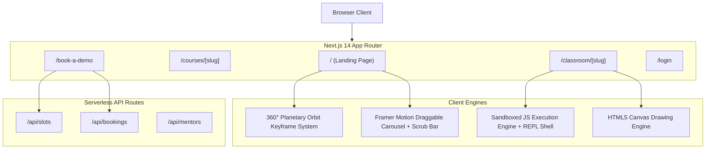

<p align="center">
  
</p>

<h1 align="center">Codeyoung 1:1 Live Online STEM Learning Platform</h1>

<p align="center">
  <strong>Next-Generation 1:1 Live Online Education Platform for Kids (Ages 5–18)</strong><br />
  Featuring Planetary Orbit UI, Interactive Draggable Course Controls, Timezone-Aware Booking Engine, and an In-Browser Live Classroom with a Workable Terminal & REPL.
</p>

<p align="center">
  
  
  
  
  
</p>

---

## 📌 Table of Contents

- [Overview](#-overview)
- [Key Features](#-key-features)
  - [1. Dynamic Hero & 360° Planetary Orbit](#1-dynamic-hero--360-planetary-orbit)
  - [2. Courses Section with Draggable Carousel & Scrub Bar](#2-courses-section-with-draggable-carousel--scrub-bar)
  - [3. Multi-Step Timezone-Aware Booking Engine](#3-multi-step-timezone-aware-booking-engine)
  - [4. Interactive 1:1 Classroom with Workable Terminal & REPL](#4-interactive-11-classroom-with-workable-terminal--repl)
  - [5. Collaborative HTML5 Math & Logic Whiteboard](#5-collaborative-html5-math--logic-whiteboard)
  - [6. Course Syllabus Trees](#6-course-syllabus-trees)
- [Terminal CLI Command Reference](#-terminal-cli-command-reference)
- [Architecture & Tech Stack](#-architecture--tech-stack)
- [Project Directory Structure](#-project-directory-structure)
- [Design System & Color Tokens](#-design-system--color-tokens)
- [Getting Started & Local Setup](#-getting-started--quick-setup)
- [Deployment Guide](#-deployment-guide)
- [Verification & Quality Assurance](#-verification--quality-assurance)

---

## 🌟 Overview

**Codeyoung** is an international EdTech web application engineered to deliver engaging 1:1 live STEM education (Coding, Math, English, Science, Robotics, and Financial Literacy) to K-12 students across the US, UK, Canada, Australia, India, and the Middle East.

Built with **Next.js 14 (App Router)**, **TypeScript**, **Tailwind CSS**, and **Framer Motion**, the application features:
- High-trust executive branding and formal academic typography.
- Frictionless parental onboarding with automated local timezone detection.
- Complete virtual classroom simulation featuring real JavaScript execution in an interactive browser terminal shell.

---

## 🚀 Key Features

### 1. Dynamic Hero & 360° Planetary Orbit
- **Enlarged Hero Visual**: High-resolution central student illustration representing interactive live learning.
- **Continuous Planetary Orbit**: Six subject badges (**Coding**, **Math**, **English**, **Science**, **Robotics**, and **Finance**) glide continuously along a 360° orbital ring around the student.
- **Counter-Rotation Physics**: Employs synchronized `@keyframes orbitSpin` and `@keyframes counterOrbitSpin` to guarantee badges stay upright and readable at every point along their orbit.

### 2. Courses Section with Draggable Carousel & Scrub Bar
- **Sliding Spring Segmented Filter**: Floating category pills with Framer Motion spring physics (`layoutId="activeCourseTab"`).
- **Dual Layout Views**:
  - **Draggable Carousel View**: Touch-swipe and mouse-drag course cards with elastic boundary resistance (`drag="x"`).
  - **Grid View**: Side-by-side card overview for comparison.
- **Tactile Draggable Scrub Bar**: A physical drag handle with a grip icon and interactive step dots allowing users to scrub through courses in real time.
- **High-Contrast Orange CTAs**: All *"Book Free Trial"* action buttons use a vibrant `#F97316` background with hover lift and arrow micro-interactions.

### 3. Multi-Step Timezone-Aware Booking Engine (`/book-a-demo`)
- **Step 1: Parent & Learner Registration**:
  - Auto-detects client timezone via `Intl.DateTimeFormat` (EDT, CDT, PDT, GMT, IST, AEST, GST).
  - Validates contact information and course/grade preferences.
- **Step 2: Interactive Date & Slot Scheduling**:
  - 5-column calendar date selector with today/tomorrow indicators.
  - Dynamically fetches local availability from `/api/slots`, clearly distinguishing between `✓ Available` and `Fully Booked` slots.
- **Step 3: Instant Confirmation & Classroom Handoff**:
  - Confetti celebration, unique booking reference ID, assigned certified mentor profile, and direct one-click link into the live classroom.

### 4. Interactive 1:1 Classroom with Workable Terminal & REPL (`/classroom/[slug]`)
- **Real JavaScript Code Execution**:
  - Clicking **"Run Code ▶"** evaluates code in an isolated runtime sandbox.
  - Intercepts `console.log`, `console.error`, and `console.warn`, displaying outputs with live timestamps and millisecond execution benchmarks.
- **Interactive Shell Prompt (`guest@codeyoung:~$`)**:
  - Directly evaluate any mathematical or JavaScript expression (e.g., `2 + 2`, `Math.sqrt(144)`, `calculateScore(2, 3)`).
  - Command history recall using **Arrow Up** and **Arrow Down** keys.
  - Maximize/minimize terminal panel toggle and output clear button.
- **Code Editor**:
  - Dedicated line numbers gutter.
  - Pre-built lesson templates (*Game Score Engine*, *Number Guessing Logic*, *Math Arithmetic Runner*).
  - One-click code reset.

### 5. Collaborative HTML5 Math & Logic Whiteboard
- Real-time drawing canvas for math scratchwork, geometry diagrams, and logic puzzles.
- Multi-color palette (Amber, Emerald, Sky Blue, Pink, White).
- Dedicated Pen and Eraser tools with brush size settings.
- Instant canvas clear button.

### 6. Course Syllabus Trees (`/courses/[slug]`)
- Comprehensive curriculum trees for Coding, Math, English, and Science.
- Interactive age bracket switcher (`Grades K - 2`, `Grades 3 - 5`, `Grades 6 - 8`, `Grades 9 - 12`).
- Details key modules, capstone projects, tools learned, and real-world outcomes.

---

## 💻 Terminal CLI Command Reference

The in-classroom terminal is fully functional and supports the following commands:

| Command | Description | Example Usage |
|---|---|---|
| `run` or `node` | Executes the code currently in the code editor | `run` |
| `test` | Runs an automated 3-part test suite on student functions | `test` |
| `help` | Lists all available terminal commands and usage instructions | `help` |
| `ls` | Lists project files in the sandbox workspace | `ls` |
| `cat <file>` | Reads and displays the contents of a workspace file | `cat README.md` |
| `mentor` | Queries Mentor Viji for instant pedagogical advice and hints | `mentor` |
| `whoami` | Displays student identity, session reference ID, and connection status | `whoami` |
| `date` | Prints the current session timestamp | `date` |
| `clear` or `cls` | Clears the terminal output screen | `clear` |
| `<JS Expression>` | Evaluates any valid JavaScript or math calculation directly | `15 * 8` or `Math.PI` |

---

## 🏗️ Architecture & Tech Stack



### Core Technologies
- **Framework**: [Next.js 14.2.23](https://nextjs.org/) (App Router, Server & Client Components)
- **Language**: [TypeScript 5.7.2](https://www.typescriptlang.org/)
- **Styling**: [Tailwind CSS 3.4.17](https://tailwindcss.com/)
- **Animation**: [Framer Motion 11.15.0](https://www.framer.com/motion/)
- **Icons**: [Lucide React 0.468.0](https://lucide.dev/)
- **Visuals**: [Canvas Confetti 1.9.4](https://www.npmjs.com/package/canvas-confetti)
- **Analytics**: [Recharts 3.10.1](https://recharts.org/)

---

## 📂 Project Directory Structure

```text
CodeYoung/
├── public/
│   └── images/               # High-resolution logos, badges, and mentor photography
├── src/
│   ├── app/
│   │   ├── api/
│   │   │   ├── bookings/     # Booking submission & slot reservation API
│   │   │   ├── email/        # Email confirmation dispatch API
│   │   │   ├── mentors/      # Mentor roster & availability API
│   │   │   └── slots/        # Timezone-converted slot availability API
│   │   ├── book-a-demo/      # 3-Step trial booking wizard
│   │   ├── classroom/[slug]/ # 1:1 Live virtual classroom & interactive terminal
│   │   ├── courses/[slug]/   # Course syllabus & curriculum trees
│   │   ├── login/            # Student & parent authentication portal
│   │   ├── globals.css       # Global CSS, orbit keyframes, and custom utilities
│   │   ├── layout.tsx        # Root HTML layout and font loading
│   │   └── page.tsx          # Homepage container
│   ├── components/
│   │   ├── CoursesGrid.tsx   # Draggable carousel, scrub bar, and segmented control
│   │   ├── Hero.tsx          # Hero visual and 360° counter-rotating planetary orbit
│   │   ├── Navbar.tsx        # Header navigation and enlarged primary logo
│   │   ├── Footer.tsx        # Footer navigation and accreditation badges
│   │   ├── MetricsBar.tsx    # Quantitative proof metrics
│   │   ├── ReviewsTrustpilot.tsx # Verified customer reviews with country filtering
│   │   ├── MentorsShowcase.tsx # Top 1% mentor credential cards
│   │   └── FaqSection.tsx    # Collapsible FAQ accordion
│   ├── lib/
│   │   ├── bookingEngine.ts  # Booking logic and timezone slot converters
│   │   └── mailer.ts         # Email notification service
│   └── styles/
│       └── design-tokens.css # Color variables and typography scales
├── README.md                 # Complete project documentation
├── REQUIREMENTS.md           # Software Requirements Specification (SRS)
├── TRANSCRIPT.md             # Chronological evolution transcript of all requests
├── tailwind.config.js        # Tailwind theme and animation configuration
├── tsconfig.json             # TypeScript compiler settings
└── package.json              # Project dependencies and run scripts
```

---

## 🎨 Design System & Color Tokens

| Token | Hex Value | Application |
|---|---|---|
| **Slate Primary** | `#0F172A` / `#080C14` | Executive typography, dark cards, terminal background |
| **Action Orange** | `#F97316` / `#FF8A00` | Primary conversion buttons (*"Book Free Trial"*), active highlights |
| **Warm Amber** | `#F59E0B` / `#FFB800` | Stars, ratings, pricing badges, orbit glows |
| **Soft Cream** | `#FFFDF7` / `#FAFAFA` | Page backgrounds, subtle light card backgrounds |
| **Verified Emerald** | `#10B981` | Accreditation badges, terminal success logs, available slots |

---

## ⚡ Getting Started & Quick Setup

### 1. Prerequisites
- **Node.js**: v18.17.0 or higher
- **npm** (or yarn / pnpm)
- **Git**

### 2. Clone & Install Dependencies
```bash
# Clone the repository
git clone https://github.com/Rakshugow/CodeYoung.git

# Navigate into the project folder
cd CodeYoung

# Install packages
npm install
```

### 3. Run Development Server
```bash
npm run dev
```
Open [http://localhost:3000](http://localhost:3000) in your browser.

### 4. Interactive Route Previews
- **Homepage**: `http://localhost:3000/`
- **Book a Free Trial**: `http://localhost:3000/book-a-demo`
- **Live Classroom & Terminal**: `http://localhost:3000/classroom/demo-CY-MUHHROJ3-636`
- **Coding Curriculum**: `http://localhost:3000/courses/coding`

### 5. Production Build
```bash
# Build optimized production bundle
npm run build

# Start production server
npm run start
```

---

## 🌐 Deployment Guide

### Deploying to Vercel (1-Click)
1. Push your changes to your GitHub repository:
   ```bash
   git push origin main
   ```
2. Navigate to [vercel.com/new](https://vercel.com/new).
3. Import the **`Rakshugow/CodeYoung`** repository.
4. Click **Deploy**. Vercel will build and deploy the application worldwide with automatic HTTPS.

---

## 🧪 Verification & Quality Assurance

- **TypeScript Compilation**: Clean build with zero errors (`npx tsc --noEmit`).
- **Production Build**: All 13 routes compile cleanly into optimized static & serverless chunks.
- **Tested Browsers**: Google Chrome, Mozilla Firefox, Apple Safari, Microsoft Edge.

---

<p align="center">
  <sub>Built with ❤️ by Rakshith Gowda for Codeyoung Education.</sub>
</p>
