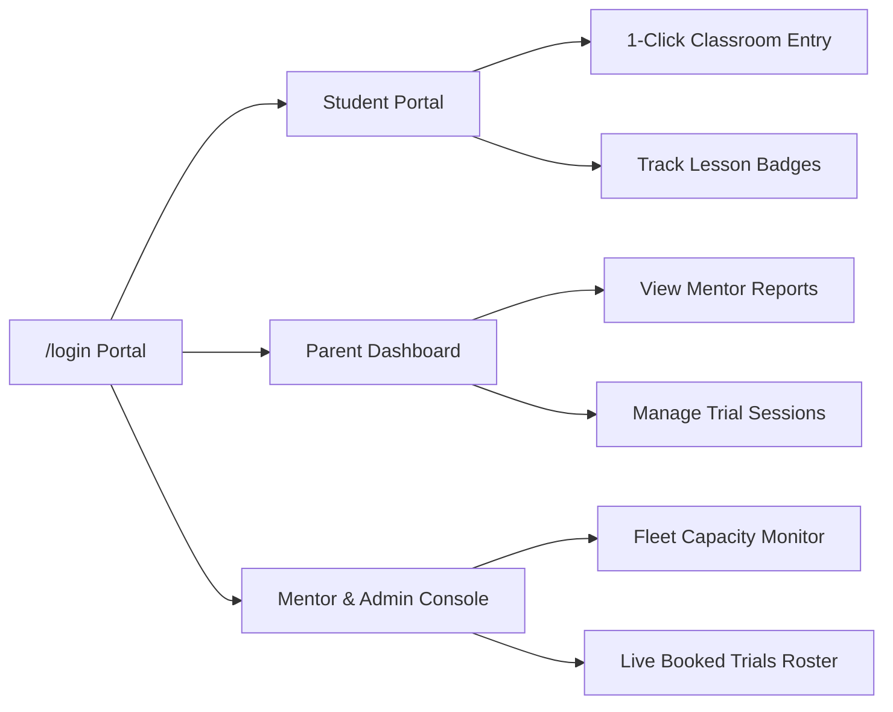

<p align="center">
  
</p>

<h1 align="center">Codeyoung — 1:1 Live Online STEM Learning Platform</h1>

<p align="center">
  <strong>Premier Global 1:1 Live Online Education Platform for Kids & Teens (Ages 5–18)</strong><br />
  Designed with an Executive Modern Aesthetic, 360° Planetary Orbit UI, Tactile Draggable Course Carousel, Frictionless Timezone-Aware Free Trial Booking, and a Multi-Role Authentication Portal.
</p>

<p align="center">
  
  
  
  
  
  
</p>

---

## 📌 Table of Contents

- [Platform Overview](#-platform-overview)
- [Aesthetic & Modern UI Design](#-aesthetic--modern-ui-design)
- [The 100% Free Trial Experience](#-the-100-free-trial-experience)
- [Multi-Role Authentication & Login Portal (`/login`)](#-multi-role-authentication--login-portal-login)
- [Interactive 1:1 Virtual Classroom with Workable Terminal](#-interactive-11-virtual-classroom-with-workable-terminal)
- [Interactive Courses & Draggable Carousel](#-interactive-courses--draggable-carousel)
- [Architecture & Tech Stack](#-architecture--tech-stack)
- [Project Directory Structure](#-project-directory-structure)
- [Getting Started & Local Setup](#-getting-started--local-setup)
- [Publishing & Deployment](#-publishing--deployment)

---

## 🌟 Platform Overview

**Codeyoung** is an international STEM education platform empowering young minds across the US, UK, Canada, Australia, India, and the Middle East. The curriculum spans **Coding**, **Mathematics**, **English Communication**, **Science**, **Robotics**, and **Financial Literacy**, connecting students with the top 1% of certified mentors for personalized 1:1 learning.

---

## ✨ Aesthetic & Modern UI Design

The entire user interface has been crafted to deliver an executive, beautiful, and deeply engaging digital experience:

- **Formal Typography Hierarchy**: Powered by **Satoshi** for bold, authoritative headings, paired with **Inter** for crystal-clear readability, and **Plus Jakarta Sans** for modern metric displays.
- **Deep Slate & Vibrant Orange Palette**: Built on an executive dark slate base (`#0F172A` / `#080C14`), balanced with crisp white surfaces, soft cream backgrounds (`#FFFDF7`), warm gold badges (`#F59E0B`), and vibrant high-contrast orange call-to-action buttons (`#F97316`).
- **360° Planetary Subject Orbit**: The central hero visual features six subject badges orbiting the learner in continuous 360° planetary motion. Synchronized counter-rotation keyframes ensure every badge remains upright and readable throughout its revolution.
- **Framer Motion Micro-Interactions**: Smooth spring physics (`type: "spring", stiffness: 450, damping: 35`) powering segmented tab controls, hover card elevations, and tactile drag controls.
- **Glassmorphic Surface Design**: Modern frosted glass containers (`backdrop-blur-md bg-white/95`) with subtle borders (`border-slate-200/90`) and ambient radiant gradients that eliminate visual clutter.

---

## 🎁 The 100% Free Trial Experience

Codeyoung offers parents and students a completely free, risk-free opportunity to experience live 1:1 mentorship before enrolling.

### Key Highlights of the Free Trial:
- **Zero Cost & Zero Obligation**: 100% complimentary 60-minute session. **No credit card required**, no hidden fees, and zero commitment.
- **Top 1% Certified Mentors**: Every trial is conducted live 1:1 by a vetted, degree-holding STEM educator who personalizes the lesson to the child's age, grade, and current skill level.
- **Build a Working Project in Session 1**: Rather than a static lecture, students immediately write working code, build interactive games, or solve mental math shortcuts directly in the live browser.
- **Comprehensive Diagnostic Skill Report**: Parents receive an in-depth mentor evaluation assessing the child's logical reasoning, creative problem-solving instincts, and an individualized roadmap for academic acceleration.

### Frictionless 3-Step Booking Wizard (`/book-a-demo`):
1. **Parent & Learner Profile**: Automatic client timezone detection (EDT, CDT, PDT, GMT, IST, AEST, GST) ensures class times fit family schedules without timezone confusion.
2. **Interactive Date & Slot Picker**: Select preferred days using intuitive calendar cards and real-time available time slots.
3. **Instant Confirmation & Live Classroom Handoff**: Celebratory confetti trigger, reference ID generation, assigned mentor details, and immediate one-click access into the live virtual classroom.

---

## 🔐 Multi-Role Authentication & Login Portal (`/login`)

The **Login Portal** provides a secure, unified dashboard tailored for students, parents, and educators.



### 1. Student Access
- **Flexible Sign-In**: Quick authentication using Mobile Number with OTP or Email & Password.
- **My Classes Dashboard**: View scheduled trial sessions, start times, and click **"Join Live Classroom"** to enter the interactive workspace instantly.
- **Achievements & Milestones**: Review badges earned in class and access practice sandbox projects.

### 2. Parent Access
- **Progress Tracking**: Access comprehensive evaluations, teacher notes, and milestone reports for each child.
- **Schedule Management**: Reschedule sessions, request mentor changes, or book complementary trial sessions for siblings across different subjects.

### 3. Mentor & Operations Fleet Management (Admin Console)
- **Role-Based Admin Authentication**: Secured access for teachers and curriculum directors.
- **Live Trial Bookings Stream**: Real-time list of all booked trials with parent contact information, selected subject, grade, and scheduled slot time.
- **Fleet Capacity & Allocation Tracker**:
  - Live monitoring of total active mentors, daily class loads, and remaining fleet capacity.
  - Auto-refreshes every 5 seconds to prevent overbooking.
  - One-click mentor launch into any student's live virtual classroom.

---

## 💻 Interactive 1:1 Virtual Classroom with Workable Terminal

Located at `/classroom/[slug]`, the virtual classroom simulates an enterprise-grade live pair-programming and STEM environment.

### Workable Interactive Terminal & REPL:
- **Live Code Execution**: Clicking **"Run Code ▶"** evaluates editor JavaScript in a captured runtime sandbox, measuring execution speed down to the millisecond.
- **Interactive Shell Prompt (`guest@codeyoung:~$`)**:
  - Direct execution of mathematical and JavaScript expressions (`15 * 8`, `Math.sqrt(256)`, etc.).
  - Command history navigation using **Arrow Up** and **Arrow Down** keys.
  - Supported terminal commands:
    - `run` / `node` — Execute the current code in the editor.
    - `test` — Run automated 3-part test assertions on student functions.
    - `help` — Show all supported commands and shortcuts.
    - `ls` — List sandbox files (`lesson_sandbox.js`, `README.md`).
    - `cat <file>` — Inspect workspace documents.
    - `whoami` — Output student session reference.
    - `mentor` — Receive dynamic feedback from Mentor Viji.
    - `clear` — Clear the console output.
- **HTML5 Collaborative Math Whiteboard**: Interactive drawing canvas featuring pen/eraser modes, multi-color palette, and brush thickness controls.
- **Live Audio & Video Controls**: Student camera stream via `getUserMedia` with fallback avatar, mentor audio controls, and screen sharing.
- **Interactive Milestones**: Dynamic checklist updating session progress in real time.

---

## 🎛 Interactive Courses & Draggable Carousel

The curriculum showcase on the homepage features two viewing experiences:

1. **Draggable Carousel with Scrub Bar**:
   - Physically drag or swipe course cards horizontally with elastic boundary resistance (`drag="x"`).
   - An interactive **Draggable Scrub Handle** (`GripHorizontal` icon) allows users to scrub across courses or jump directly using step dots.
   - Smooth previous/next navigation buttons with tactile spring feedback.
2. **Animated Segmented Category Switcher**:
   - Filter between *All Subjects*, *Coding*, *Math*, *English*, and *Science*.
   - A dark slate pill glides fluidly beneath the selected category using Framer Motion layout animations.
3. **Curriculum Syllabus Trees (`/courses/[slug]`)**:
   - Dedicated syllabus pages breaking down age brackets (K-2, 3-5, 6-8, 9-12), module progressions, capstone projects, and learning outcomes.

---

## 🏗️ Architecture & Tech Stack

| Component | Technology | Purpose |
|---|---|---|
| **Framework** | Next.js 14.2 (App Router) | High-performance hybrid SSR & Client rendering |
| **Language** | TypeScript 5.7 | End-to-end type safety and zero-error builds |
| **Styling** | Tailwind CSS 3.4 | Utility-first responsive design tokens |
| **Motion & Physics** | Framer Motion 11.15 | Spring physics, layout animations, and gesture tracking |
| **Icons** | Lucide React | Consistent, scalable vector interface icons |
| **Visual FX** | Canvas Confetti | Celebratory confirmation animations |

---

## 📂 Project Directory Structure

```text
CodeYoung/
├── public/
│   └── images/               # High-res logos, subject icons, mentor portraits
├── src/
│   ├── app/
│   │   ├── api/
│   │   │   ├── bookings/     # Booking creation & slot reservation
│   │   │   ├── email/        # Confirmation email dispatcher
│   │   │   ├── mentors/      # Mentor roster & availability engine
│   │   │   └── slots/        # Timezone-converted slot availability
│   │   ├── book-a-demo/      # 3-Step trial booking wizard
│   │   ├── classroom/[slug]/ # 1:1 Live classroom with workable terminal
│   │   ├── courses/[slug]/   # Subject curriculum syllabus pages
│   │   ├── login/            # Student, parent & mentor login portal
│   │   ├── globals.css       # Orbit keyframes and design variables
│   │   ├── layout.tsx        # Root HTML wrapper & fonts
│   │   └── page.tsx          # Main homepage
│   ├── components/
│   │   ├── CoursesGrid.tsx   # Draggable carousel, scrub bar & segmented pill
│   │   ├── Hero.tsx          # Hero visual & 360° planetary subject orbit
│   │   ├── Navbar.tsx        # Executive header & primary logo
│   │   ├── Footer.tsx        # Footer navigation & accreditations
│   │   ├── MetricsBar.tsx    # Quantitative social proof metrics
│   │   ├── ReviewsTrustpilot.tsx # Verified customer reviews
│   │   ├── MentorsShowcase.tsx # Top 1% mentor credentials
│   │   └── FaqSection.tsx    # Interactive FAQ accordion
│   └── lib/
│       ├── bookingEngine.ts  # Booking state & timezone algorithms
│       └── mailer.ts         # Notification service
├── README.md                 # Project documentation
├── REQUIREMENTS.md           # Software Requirements Specification (SRS)
├── TRANSCRIPT.md             # Chronological evolution log
├── tailwind.config.js        # Tailwind styling & animations
└── tsconfig.json             # TypeScript compiler configuration
```

---

## ⚡ Getting Started & Local Setup

### 1. Prerequisites
- **Node.js**: v18.17.0 or higher
- **npm** (or yarn / pnpm)

### 2. Installation
```bash
# Navigate to project folder
cd CodeYoung

# Install dependencies
npm install
```

### 3. Run Development Server
```bash
npm run dev
```
Open **[http://localhost:3000](http://localhost:3000)** in your browser.

### 4. Direct Route Links
- **Homepage**: `http://localhost:3000/`
- **Book Free Trial**: `http://localhost:3000/book-a-demo`
- **Login Portal**: `http://localhost:3000/login`
- **Live Classroom**: `http://localhost:3000/classroom/demo-CY-MUHHROJ3-636`
- **Coding Syllabus**: `http://localhost:3000/courses/coding`

---

## 🌐 Publishing & Deployment

The production build compiles cleanly into optimized static & serverless chunks (`npm run build`).

### 1-Click Deployment to Vercel (Recommended):
1. Push your repository to GitHub:
   ```bash
   git push origin main
   ```
2. Go to **[vercel.com/new](https://vercel.com/new)** and import your repository.
3. Click **Deploy**. Vercel will build and deploy the application globally with automatic SSL certificates.

---

<p align="center">
  <sub>Codeyoung Education — Empowering the next generation of creators, innovators, and leaders.</sub>
</p>
