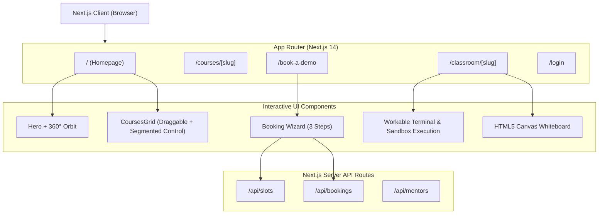

# Software Requirements Specification (SRS)

**Project Name**: Codeyoung 1:1 Live Online Learning Platform  
**Document Version**: 1.0.0  
**Status**: Approved & Implemented  
**Date**: September 26, 2024  

---

## 1. Executive Summary & Purpose

The purpose of this document is to formally define all **functional**, **non-functional**, **architectural**, and **interface requirements** for the **Codeyoung 1:1 Live Learning Platform**. 

The platform serves K-12 students (Ages 5-18) and parents globally across the US, UK, Canada, Australia, India, and the Middle East. It delivers an end-to-end learning lifecycle: from dynamic curriculum exploration and automated timezone-aware trial booking to an interactive virtual classroom featuring real-time code execution and collaborative whiteboarding.

---

## 2. User Personas

| Persona | Description | Primary Needs & Goals |
|---|---|---|
| **Parent (Decision Maker)** | Working parent seeking premium STEM education for their child. | High trust signals, verified teacher qualifications, flexible scheduling in local time, transparent pricing, and instant booking confirmation. |
| **Student (End Learner)** | K-12 learner aged 5 to 18 with diverse learning paces. | Fun, engaging, friction-free learning environment with interactive code sandbox, immediate visual feedback, and collaborative whiteboard. |
| **STEM Mentor (Teacher)** | Certified educator conducting live 1:1 lessons. | Structured lesson roadmap, code synchronization, video controls, and diagnostic progress evaluation. |

---

## 3. Functional Requirements (FR)

### Module 1: Landing Page & Marketing Portal (`/`)

- **FR-1.1: Hero Orbit & Visual Identity**
  - **FR-1.1.1**: The central hero visual must display a prominent high-resolution student visual (`w-[420px] lg:w-[480px]`).
  - **FR-1.1.2**: Six core subject badges (Coding, Math, English, Science, Robotics, Finance) must continuously orbit the student in a **360° planetary trajectory** with counter-rotation to maintain horizontal legibility at all times.
  - **FR-1.1.3**: Primary call-to-action button *"Book a FREE Trial Class"* must feature a high-contrast orange background (`#F97316`) directing users to `/book-a-demo`.

- **FR-1.2: Metrics & Trust Bar**
  - **FR-1.2.1**: Prominently display key quantitative proof: **30K+ Active Students**, **750K+ Classes Taught**, **4.8★ Parent Satisfaction Rating**, and **Top 1% STEM Mentors**.

- **FR-1.3: Interactive Courses Grid & Draggable Carousel**
  - **FR-1.3.1**: Must provide a segmented category filter bar (`All Subjects`, `Coding`, `Math`, `English`, `Science`) with animated spring physics layout pill (`layoutId="activeCourseTab"`).
  - **FR-1.3.2**: Must support **Draggable Carousel View** with touch swipe and mouse drag (`drag="x"` with elastic boundary resistance).
  - **FR-1.3.3**: Must provide an interactive **Draggable Scrub Bar** with a physical drag handle (`GripHorizontal` icon), step indicator dots, and previous/next buttons.
  - **FR-1.3.4**: Must support toggling between **Draggable Slider View** and **Grid View**.
  - **FR-1.3.5**: Each course card must display price per class, age bracket, key modules, outcomes, and two action buttons: *"Curriculum Details"* (links to course subpage) and *"Book Free Trial"* (orange background).

- **FR-1.4: Verified Reviews & Testimonials**
  - **FR-1.4.1**: Display Trustpilot (4.4★) and Google Reviews (4.8★) ratings.
  - **FR-1.4.2**: Must allow filtering parent reviews by country (`All`, `USA`, `UK`, `Canada`, `Australia`, `India`).

- **FR-1.5: Mentors Showcase & Ecosystem**
  - **FR-1.5.1**: Highlight verified mentors with credentials, STEM degrees, total tutoring hours (e.g. 5,000+ hrs), and direct parent quotes.
  - **FR-1.5.2**: Filter mentors by discipline.

- **FR-1.6: FAQ Accordion & Floating Support**
  - **FR-1.6.1**: Interactive collapsible accordion answering frequent parental questions on pricing, device requirements, and curriculum mapping.
  - **FR-1.6.2**: Floating action button (FAB) for direct support inquiries.

---

### Module 2: Multi-Step Trial Booking Engine (`/book-a-demo`)

- **FR-2.1: Step 1 – Registration & Preferences**
  - **FR-2.1.1**: Form fields required: Parent's Full Name, Email ID, Country Code (+1, +44, +91, +61, +971, +65, etc.), Mobile Number, Child's Grade (K to 12), and Selected Subject.
  - **FR-2.1.2**: Automatic client timezone detection via `Intl.DateTimeFormat().resolvedOptions().timeZone` with manual override dropdown.
  - **FR-2.1.3**: Field-level validation: email format verification, phone length verification, mandatory terms checkbox.
  - **FR-2.1.4**: Primary submission button *"Proceed to Slot Selection"* in vibrant orange (`#F97316`).

- **FR-2.2: Step 2 – Date & Local Time Slot Selection**
  - **FR-2.2.1**: Five-day upcoming date selector cards with day name, formatted date, and today/tomorrow tags.
  - **FR-2.2.2**: Dynamic slot retrieval from `/api/slots` filtered by selected date, subject, and parent timezone.
  - **FR-2.2.3**: Clear slot availability status: `✓ Available` (selectable) vs `Fully Booked` (disabled).
  - **FR-2.2.4**: Confirmation CTA *"Confirm & Book Trial Class"* in orange with active loading spinner state during submission.

- **FR-2.3: Step 3 – Instant Confirmation & Virtual Classroom Handoff**
  - **FR-2.3.1**: Trigger celebratory visual confetti on successful booking.
  - **FR-2.3.2**: Display unique reference ID (e.g. `Ref #demo-CY-MUHHROJ3-636`).
  - **FR-2.3.3**: Provide active 1:1 Live Demo Classroom URL with one-click **Copy Link** and direct **"Enter Live Classroom"** button.
  - **FR-2.3.4**: Display assigned certified mentor profile, qualifications, scheduled local time, and parental preparation checklist.

---

### Module 3: 1:1 Live Interactive Classroom (`/classroom/[slug]`)

- **FR-3.1: Workable Interactive Terminal & REPL Shell**
  - **FR-3.1.1 (Code Execution)**: Clicking *"Run Code ▶"* must execute the code from the editor inside an isolated sandbox, capturing `console.log`, `console.error`, `console.warn`, and `console.info`, rendering timestamps and millisecond performance benchmarks.
  - **FR-3.1.2 (Interactive Shell Input)**: Terminal must accept direct user command inputs via `guest@codeyoung:~$ ` prompt.
  - **FR-3.1.3 (Dynamic REPL Evaluation)**: Any valid JavaScript expression typed in the terminal (e.g. `12 * 9`, `Math.sqrt(256)`, `calculateScore(2, 3)`) must be dynamically evaluated and output formatted.
  - **FR-3.1.4 (Supported Shell Commands)**:
    - `run` / `node`: Runs the current editor code.
    - `test`: Executes automated 3-part unit tests on the student's solution.
    - `help`: Lists all available commands.
    - `ls`: Lists files in the sandbox workspace.
    - `cat <file>`: Displays file contents (e.g. `cat README.md`).
    - `whoami`: Displays student identity and session ID.
    - `mentor`: Outputs pedagogical advice from Mentor Viji.
    - `date`: Prints current timestamp.
    - `clear` / `cls`: Clears the terminal screen.
  - **FR-3.1.5 (Command History Navigation)**: Pressing **Arrow Up** and **Arrow Down** must cycle through previously executed command history.
  - **FR-3.1.6 (Terminal Controls)**: Include **Maximize/Minimize** toggle and a quick **Clear Output** trash button.

- **FR-3.2: Code Editor Workspace**
  - **FR-3.2.1**: Monospace syntax textarea with line numbers gutter.
  - **FR-3.2.2**: Template selector supporting multiple pre-built lessons (*Game Score Engine*, *Number Guessing Logic*, *Math Arithmetic Runner*).
  - **FR-3.2.3**: Reset code button to restore default template code.

- **FR-3.3: Interactive Math & Drawing Whiteboard**
  - **FR-3.3.1**: Real-time collaborative HTML5 canvas drawing board.
  - **FR-3.3.2**: Multi-color palette (Amber, Emerald, Sky Blue, Pink, White).
  - **FR-3.3.3**: Switchable Pen and Eraser modes.
  - **FR-3.3.4**: Clear canvas button.

- **FR-3.4: Lesson Milestones Roadmap**
  - **FR-3.4.1**: Interactive milestone checklist showing session progress (Diagnostic, Logic Foundations, Hands-on Challenge, Terminal Test, Final Roadmap).
  - **FR-3.4.2**: Clicking milestones toggles status and updates completion badge.

- **FR-3.5: Video Conferencing & Audio Controls**
  - **FR-3.5.1**: Dual video tiles: Mentor Tile (with live pulse status) and Student Tile.
  - **FR-3.5.2**: Student webcam integration via `navigator.mediaDevices.getUserMedia` with fallback animated avatar when camera is disabled.
  - **FR-3.5.3**: Toolbar controls: Toggle Mic, Toggle Video, Screen Sharing (`getDisplayMedia`), Mentor Audio Mute, and End Class button.

- **FR-3.6: Real-Time Session Chat**
  - **FR-3.6.1**: Two-way chat stream with simulated mentor responses and automated AI assistant prompts.

---

### Module 4: Course Curriculum Catalog (`/courses/[slug]`)

- **FR-4.1**: Dynamic routing supporting `/courses/coding`, `/courses/math`, `/courses/english`, and `/courses/science`.
- **FR-4.2**: Interactive Grade Bracket Navigation (`Grades K - 2`, `Grades 3 - 5`, `Grades 6 - 8`, `Grades 9 - 12`) with animated spring pill indicator.
- **FR-4.3**: Module breakdown, tools learned (Scratch, Python, CAS, Desmos, etc.), capstone projects, and mentor ratings.
- **FR-4.4**: Sticky booking CTA banners with orange trial buttons.

---

## 4. Non-Functional Requirements (NFR)

### NFR-1: Performance & Responsiveness
- **NFR-1.1**: Initial Page Load (First Contentful Paint) < 1.2s on high-speed broadband.
- **NFR-1.2**: In-browser JavaScript code execution latency < 200ms for standard computational scripts.
- **NFR-1.3**: Fully responsive across mobile (<640px), tablet (640px - 1024px), and desktop (>1024px).

### NFR-2: Usability & Aesthetic Quality
- **NFR-2.1**: Clean, formal, modern EdTech aesthetic matching global Ivy-League/STEM academy standards.
- **NFR-2.2**: High contrast ratio (WCAG 2.1 AA compliant) between typography and background across all light and dark modes.
- **NFR-2.3**: Fluid 60fps animations for Framer Motion gestures, segmented control sliding, and orbital rotation.

### NFR-3: Security & Sandbox Isolation
- **NFR-3.1**: In-browser code execution must be sandboxed via wrapped closures, preventing prototype pollution or unauthorized DOM manipulation.
- **NFR-3.2**: Form submissions must sanitize input values before dispatching to API routes.
- **NFR-3.3**: Session classroom links must use cryptographically pseudo-random reference IDs (`CY-MUHHROJ3-XXX`).

### NFR-4: Reliability & Compatibility
- **NFR-4.1**: Zero unhandled client exceptions or fatal TypeScript compilation errors (`tsc --noEmit` must pass with 0 errors).
- **NFR-4.2**: Cross-browser compatibility across Google Chrome (v90+), Mozilla Firefox (v90+), Apple Safari (v14+), and Microsoft Edge (v90+).

---

## 5. System Architecture & Component Mapping



---

## 6. Data Models & API Specifications

### Data Model: `Booking`
```typescript
interface Booking {
  id: string;               // e.g. "CY-MUHHROJ3-636"
  parentName: string;       // e.g. "Sarah Jenkins"
  parentEmail: string;      // e.g. "sarah@example.com"
  phone: string;            // e.g. "+1 4088092244"
  course: string;           // e.g. "Coding (Ages 5-16)"
  grade: string;            // e.g. "Grade 4"
  dateLocal: string;        // YYYY-MM-DD
  slotLocal: string;        // "09:00 AM - 10:00 AM"
  parentTimeZone: string;   // "America/New_York"
  mentorName: string;       // Assigned mentor name
  mentorAvatar: string;     // Mentor photo path
  liveClassLink: string;    // "/classroom/demo-CY-MUHHROJ3-636"
  createdAt: string;        // ISO timestamp
}
```

### Data Model: `TimeSlotAvailability`
```typescript
interface TimeSlotAvailability {
  slot: string;             // "09:00 AM - 10:00 AM"
  isAvailable: boolean;     // true / false
  capacityLeft: number;     // e.g. 1
}
```

---

## 7. Acceptance Criteria (Definition of Done)

1. **Orbiting Hero**: Six badges orbit smoothly around the student without text upside-down tilting.
2. **Draggable Courses Slider**: User can drag either the cards directly OR the bottom scrub button to switch courses with spring physics.
3. **Orange CTA**: All "Book Free Trial" buttons render with `#F97316` / `bg-orange-500` and white text.
4. **Booking Wizard**: Step 1 validates inputs -> Step 2 dynamically loads local slots -> Step 3 delivers confirmation with working classroom link and confetti.
5. **Workable Classroom Terminal**:
   - Running code prints actual execution output.
   - Typing commands (`run`, `test`, `help`, `ls`, `clear`) in `guest@codeyoung:~$ ` produces correct responses.
   - Typing mathematical or JS expressions evaluates them in real time.
   - Arrow Up / Arrow Down navigates command history.
6. **Working Whiteboard**: Canvas responds to mouse and touch drawing with color switching and clear functionality.
7. **Type Safety**: `npx tsc --noEmit` exits with status code 0.
